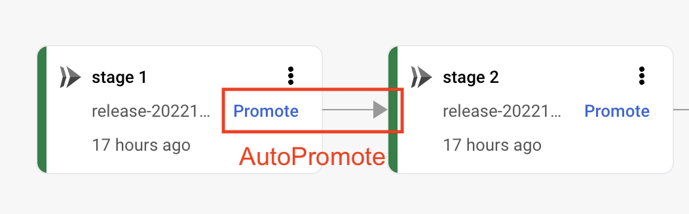
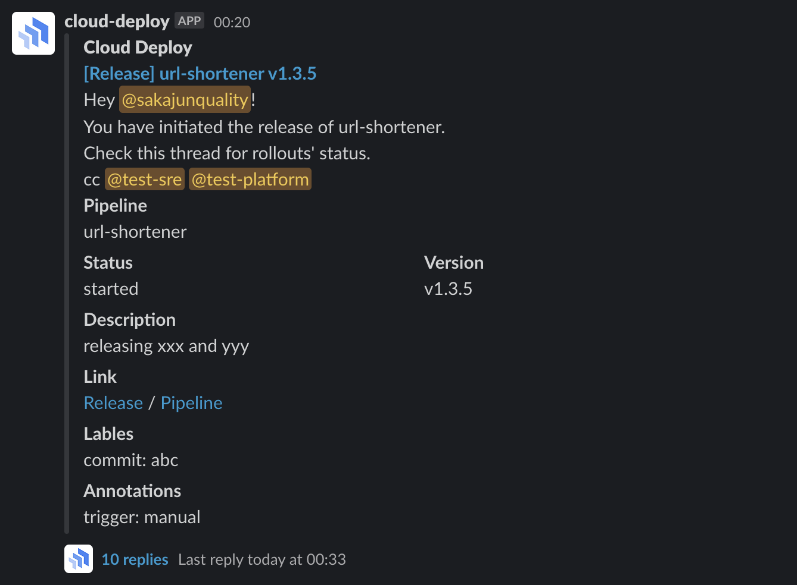
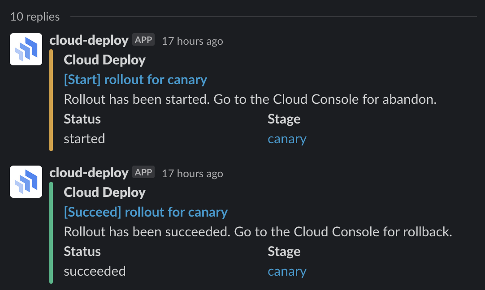
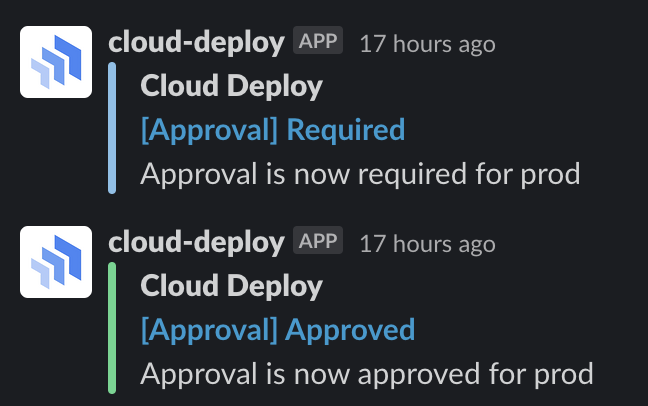

# clouddeploy-functions

PoC Automation of Cloud Deploy w/ Cloud Functions

## AutoPromote

Automatically promote rollout to next stage in a serialPipeline.



### How to Deploy

1. Prepare a new service account for this function.
2. Add `roles/clouddeploy.releaser` permission at project level.
3. Add `roles/iam.serviceAccountUser` permission at Cloud Deploy execution service account.
4. Deploy Cloud Function with entrypoint `AutoPromote` and subscribe to `clouddeploy-operations` topic.

### Example Deploy

```bash
gcloud functions deploy cloud-deploy-auto-promote \
    --gen2 \
    --runtime=go119 \
    --project=[PROJECT ID] \
    --region=[REGION] \
    --source=. \
    --entry-point=AutoPromote \
    --trigger-topic=clouddeploy-operations \
    --service-account=[Service Account] \
    --serve-all-traffic-latest-revision \
    --timeout=540 \
    --memory=128Mi
```

### Limitations

Currently allowing or disallowing pipelines is not yet implimented. If you need, adding approval is highly recommended. 

## NotifySlackWithThread

Post message to Slack channel when release is created.



Post rollout status to Slack thread of its release.




### Configurations

#### Environment Variables

- SLACK_TOKEN
- SLACK_CHANNEL
- SLACK_BOT_STATE_BUCKET

#### Annotations
Notification messages can be customized by adding annotations to release.

| name               | usage                                   | value                         |
|--------------------|-----------------------------------------|-------------------------------|
| deployer-slack-id  | optional: mention in release post       | Slack UserID                  |
| cc-slack-group-ids | optional: mention group in release post | Comma separated Slack GroupID |

### How to Deploy

TBD

### Example Deploy

TBD

```bash
gcloud functions deploy...
```


## NotifySlackApprovalWithThread

Post approval status to Slack thread of its release.



### Configurations

#### Environment Variables

- SLACK_TOKEN
- SLACK_CHANNEL
- SLACK_BOT_STATE_BUCKET

#### Annotations

- TBD

### How to Deploy

TBD

### Example Deploy

TBD

```bash
gcloud functions deploy...
```


## NotifyApprovalRequestSlackSimple

Notify approval status changes to slack.

### How to Deploy

1. Prepare a new service account for this function.
2. Add Slack token to Cloud Secret Manager and allow the service account `roles/secretmanager.secretAccessor` role. Secrets can be accesible both via Cloud Run Integration and berglas.
3. Deploy Cloud Function with entrypoint `NotifyApprovalRequestSlackSimple` and subscribe to `clouddeploy-approvals` topic.

### Example Deploy

```bash
gcloud functions deploy cloud-deploy-approvals-notify \
    --gen2 \
    --runtime=go119 \
    --project=[PROJECT ID] \
    --region=[REGION] \
    --source=. \
    --entry-point=NotifyApprovalRequestSlackSimple \
    --trigger-topic=clouddeploy-approvals \
    --service-account=[Service Account] \
    --serve-all-traffic-latest-revision \
    --timeout=540 \
    --memory=128Mi \
    --set-env-vars="SLACK_APPROVAL_CHANNEL=[CHANNEL ID]" \
    --set-secrets='SLACK_TOKEN=projects/[PROJECT ID]/secrets/[SECRET ID]/versions/latest'
```
